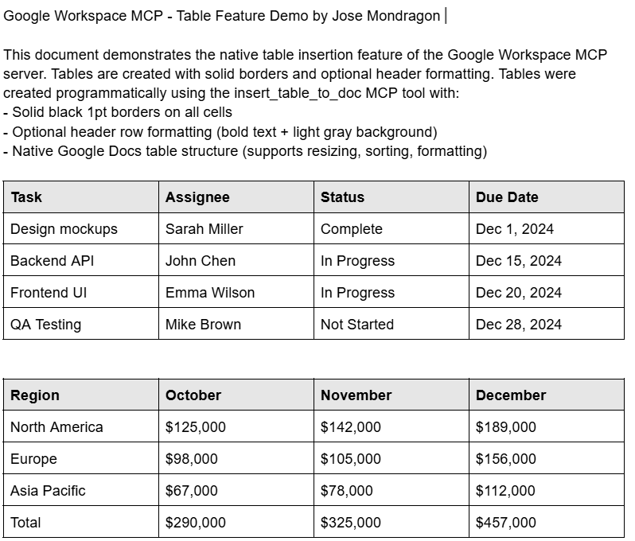

# Google Workspace MCP Server

A Model Context Protocol (MCP) server that enables Claude to create and manage Google Docs, Sheets, Slides, and Drive directly.

## Features

- **Google Docs**: Create, read, update documents with tables, images, and links
- **Google Sheets**: Read/write data, format cells
- **Google Slides**: Create presentations, add slides, text, and images
- **Google Drive**: List, upload, download files, search, PDF text extraction
- **PDF OCR**: Convert PDFs to Google Docs and extract text using Google's OCR
- Insert images (from URLs or local files) into documents and slides
- Insert native tables with borders, centered bold headers
- Insert clickable hyperlinks (for video links, etc.)
- Format text and cells (bold, italic, underline, colors)

## Prerequisites

- Node.js v18 or higher
- A Google Cloud account
- Claude Desktop or Claude Code

## Quick Start

### 1. Clone and Install

```bash
git clone <your-repo-url>
cd google-workspace-mcp
npm install
```

### 2. Set Up Google Cloud Credentials

#### a. Create a Google Cloud Project

1. Go to [Google Cloud Console](https://console.cloud.google.com)
2. Click "Select a project" → "New Project"
3. Enter a project name and click "Create"

#### b. Enable Required APIs

In your Google Cloud project, go to "APIs & Services" → "Library" and enable:
- Google Docs API
- Google Sheets API
- Google Slides API
- Google Drive API

#### c. Create OAuth 2.0 Credentials

1. Go to "APIs & Services" → "Credentials"
2. Click "Create Credentials" → "OAuth client ID"
3. Configure OAuth consent screen if prompted:
   - User Type: **External**
   - App name: Your choice (e.g., "Google Workspace MCP")
   - Add your email for support and developer contact
   - Click "Save and Continue"
4. On "Create OAuth client ID":
   - Application type: **Desktop app**
   - Name: "Google Workspace MCP" (or your choice)
   - Click "Create"
5. Click "Download JSON"
6. Save the downloaded file as `credentials.json` in the project root directory

#### d. Add Test Users

Since your app is in testing mode:
1. Go to "APIs & Services" → "OAuth consent screen"
2. Scroll to "Test users" → Click "Add Users"
3. Enter your Google account email
4. Click "Save"

### 3. Build the Project

```bash
npm run build
```

### 4. Authenticate with Google

Run the one-time authentication:

```bash
npm run auth
```

This will:
1. Display a Google authorization URL
2. Open it in your browser (or copy/paste manually)
3. Ask you to sign in and grant permissions
4. Provide an authorization code

**Steps:**
1. Click "Allow" to grant permissions
2. Copy the authorization code
3. Paste it into the terminal
4. Press Enter

A `token.json` file will be created with your access credentials.

### 5. Configure Claude

#### Windows
1. Navigate to `%APPDATA%\Claude\`
2. Open or create `claude_desktop_config.json`
3. Add this configuration (update the path to match your installation):

```json
{
  "mcpServers": {
    "google-workspace": {
      "command": "node",
      "args": ["C:\\Users\\YOUR_USERNAME\\path\\to\\google-workspace-mcp\\dist\\index.js"]
    }
  }
}
```

#### macOS/Linux
1. Edit `~/Library/Application Support/Claude/claude_desktop_config.json`
2. Add this configuration:

```json
{
  "mcpServers": {
    "google-workspace": {
      "command": "node",
      "args": ["/absolute/path/to/google-workspace-mcp/dist/index.js"]
    }
  }
}
```

#### Claude Code (CLI) - Global Setup

To make the MCP available in all Claude Code sessions, edit `~/.claude/settings.json`:

**Windows:** `C:\Users\YOUR_USERNAME\.claude\settings.json`

```json
{
  "mcpServers": {
    "google-workspace": {
      "command": "node",
      "args": ["C:\\Users\\YOUR_USERNAME\\path\\to\\google-workspace-mcp\\dist\\index.js"]
    }
  }
}
```

**macOS/Linux:** `~/.claude/settings.json`

```json
{
  "mcpServers": {
    "google-workspace": {
      "command": "node",
      "args": ["/absolute/path/to/google-workspace-mcp/dist/index.js"]
    }
  }
}
```

Verify with: `claude mcp list`

### 6. Restart Claude

Completely quit and restart Claude Desktop/Code (not just close the window).

## Available Tools (32 total)

### Google Docs (11 tools)
- `create_document` - Create a new Google Doc
- `read_document` - Read document content
- `update_document` - Replace ALL document text (fixed: now deletes entire content)
- `insert_image_to_doc` - Insert image from URL
- `insert_local_image_to_doc` - Insert image from local file
- `format_text_in_doc` - Format text (bold, italic, underline, color)
- `insert_table_to_doc` - Insert a native table with borders and header formatting
- `insert_link_to_doc` - Insert clickable hyperlinks (for video links, URLs)
- `append_text_to_doc` - Append text to end of document (no index needed)
- `format_titles_in_doc` - Auto-detect and bold titles (emoji lines, headers, colons)
- `format_first_line_as_title` - Format first line as bold title with larger font

### Google Sheets (4 tools)
- `create_spreadsheet` - Create a new spreadsheet
- `read_sheet` - Read data from a range
- `write_sheet` - Write data to a range
- `format_cells` - Format cells (bold, italic, underline, colors)

### Google Slides (7 tools)
- `create_presentation` - Create a new presentation
- `read_presentation` - Get presentation data
- `add_slide` - Add a new slide
- `add_text_to_slide` - Add text to a slide
- `insert_image_to_slide` - Insert image from URL
- `insert_local_image_to_slide` - Insert image from local file
- `format_text_in_slide` - Format text in slides

### Google Drive (10 tools)
- `list_drive_files` - List files and folders in Drive
- `upload_file` - Upload any file type to Drive
- `download_file` - Download files from Drive
- `get_file_content` - Read text content of files
- `get_file_metadata` - Get file info (size, type, dates)
- `create_folder` - Create folders in Drive
- `delete_file` - Delete files or folders
- `search_files` - Search files by name or content
- `make_file_public` - Make file public and get shareable URL
- `convert_pdf_to_doc` - Convert PDF to Google Doc using OCR
- `extract_pdf_text` - Extract text from PDF files

## Usage Examples

Once connected, you can ask Claude:

**Documents:**
- "Create a new Google Doc called 'Meeting Notes'"
- "Add this content to my document: [your text]"
- "Make the title bold in my document"
- "Insert a table with project tasks and status"
- "Add a link to this YouTube video in my document"

**Spreadsheets:**
- "Create a new spreadsheet called 'Q1 Budget'"
- "Write this data to cells A1:C3 in my spreadsheet"
- "Read the data from Sheet1!A1:D10"

**Presentations:**
- "Create a new presentation called 'Project Proposal'"
- "Add a slide with the title 'Overview'"
- "Insert this image into the first slide"

**Drive:**
- "List all files in my Google Drive"
- "Upload this PDF to my Drive"
- "Search for files containing 'report'"
- "Extract text from this PDF file"
- "Create a folder called 'Project Files'"
- "Download this file from Drive"

**PDF Processing:**
- "Extract all text from this PDF: C:\path\to\file.pdf"
- "Convert this PDF to a Google Doc so I can edit it"

## Table Feature

The `insert_table_to_doc` tool creates native Google Docs tables with:
- **Solid black borders** on all cells (1pt weight)
- **Header row formatting** (optional) - bold text, centered, with light gray background
- Automatic newline insertion to prevent cutting existing text
- Proper cell structure that supports sorting, resizing, and formatting

### Table Example

When you ask Claude to insert a table, it creates a properly formatted table like this:



### Table Parameters

| Parameter | Type | Required | Description |
|-----------|------|----------|-------------|
| `documentId` | string | Yes | The Google Doc ID |
| `index` | number | Yes | Position in document (1 = start) |
| `rows` | number | Yes | Number of rows |
| `columns` | number | Yes | Number of columns |
| `data` | string[][] | Yes | 2D array of cell contents |
| `headerRow` | boolean | No | Format first row as header (bold + gray background) |

### Example Usage

```json
{
  "documentId": "1abc123...",
  "index": 1,
  "rows": 3,
  "columns": 2,
  "data": [
    ["Name", "Status"],
    ["Task 1", "Complete"],
    ["Task 2", "In Progress"]
  ],
  "headerRow": true
}
```

## Troubleshooting

### "Error: credentials.json not found"
- Ensure you downloaded OAuth credentials from Google Cloud Console
- Verify the file is named exactly `credentials.json`
- Place it in the project root directory

### "Error: token.json not found"
- Run `npm run auth` to complete authentication
- Make sure you paste the authorization code correctly

### "Invalid grant" or "Token expired"
- Delete `token.json`
- Run `npm run auth` again

### "Access blocked: This app's request is invalid"
- Add your Google account as a test user in OAuth consent screen
- Verify all required APIs are enabled

### MCP server not showing in Claude
- Verify the path in `claude_desktop_config.json` is correct
- Use double backslashes on Windows (`C:\\Users\\...`)
- Ensure you ran `npm run build`
- Completely quit and restart Claude

### "Cannot find module" errors
- Run `npm install` to ensure dependencies are installed

## Security Notes

**IMPORTANT:** Never commit these files to version control:
- `credentials.json` - Contains your OAuth client secret
- `token.json` - Contains your access tokens

These files are already in `.gitignore`.

## For New Users Cloning This Repo

If you cloned this repository, you must create your own Google Cloud credentials:

1. **Go to [Google Cloud Console](https://console.cloud.google.com)**

2. **Create a new project** (or select existing one)

3. **Enable these APIs** (APIs & Services → Library):
   - Google Docs API
   - Google Sheets API
   - Google Slides API
   - Google Drive API

4. **Configure OAuth consent screen** (APIs & Services → OAuth consent screen):
   - User Type: External
   - Add your email as a test user

5. **Create OAuth credentials** (APIs & Services → Credentials):
   - Click "Create Credentials" → "OAuth client ID"
   - Application type: **Desktop app**
   - Download the JSON file

6. **Rename and place the file**:
   - Rename downloaded file to `credentials.json`
   - Place it in the project root directory

7. **Run authentication**:
   ```bash
   npm install
   npm run build
   npm run auth
   ```

See `credentials.example.json` for the expected file structure

## Project Structure

```
google-workspace-mcp/
├── src/                       # Source code
│   ├── interfaces/            # TypeScript interfaces
│   │   ├── IDocumentService.ts
│   │   ├── ISheetService.ts
│   │   ├── ISlideService.ts
│   │   └── IDriveService.ts
│   ├── services/              # Google API services
│   │   ├── GoogleAuthService.ts
│   │   ├── DocumentService.ts
│   │   ├── SheetService.ts
│   │   ├── SlideService.ts
│   │   └── DriveService.ts
│   ├── utils/                 # Shared utilities
│   │   ├── DriveUploadHelper.ts
│   │   └── FormattingHelper.ts
│   ├── tools/                 # MCP tool definitions (Zod schemas)
│   ├── authenticate.ts        # Auth script
│   └── index.ts              # Main MCP server
├── dist/                      # Compiled JavaScript (after build)
├── credentials.json          # Your OAuth credentials (DO NOT COMMIT)
├── token.json               # Access token (DO NOT COMMIT)
├── credentials.example.json  # Template for credentials
├── token.example.json       # Template for token
├── package.json
├── tsconfig.json
└── README.md
```

## Commands Reference

```bash
# Install dependencies
npm install

# Build the project
npm run build

# Run authentication (first time only)
npm run auth

# Start server (for testing)
npm run start

# Development mode with auto-reload
npm run dev
```

## Additional Documentation

- **MCP_CREATION_GUIDE.md** - Learn how this MCP server was built from scratch
- **SETUP_GUIDE.md** - Detailed setup instructions with screenshots

## Resources

- [MCP SDK Documentation](https://github.com/modelcontextprotocol/sdk)
- [Google APIs Node.js Client](https://github.com/googleapis/google-api-nodejs-client)
- [Google Cloud Console](https://console.cloud.google.com)
- [Claude Code Documentation](https://docs.claude.com)

## License

MIT
